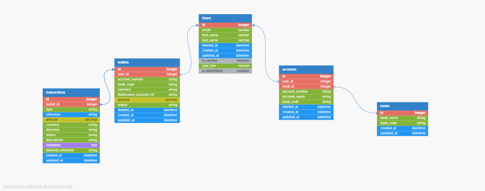

# Demo Credit - Wallet Application

[](https://nodejs.org/)
[](https://www.typescriptlang.org/)

A secure and scalable banking/wallet application that provides credit services, user management, and transaction processing. This repository contains the backend services (TypeScript + Node.js) and tests.

## Overview

Demo Credit is a comprehensive financial services platform that enables users to manage digital wallets, perform bank transfers, receive credit services, and handle various financial transactions securely. The system integrates with external payment providers like Flutterwave for seamless deposit and withdrawal operations.

Key features include:
- User authentication with OTP verification
- Wallet management with balance tracking
- Bank account linking and transfers
- Transaction history and webhooks
- KYC verification and user blacklisting
- Secure API endpoints with JWT authentication

## Architecture & Design Approaches

This project follows a **Layered Architecture** (also known as Clean Architecture or Hexagonal Architecture) to ensure separation of concerns, testability, and maintainability. The architecture is divided into the following layers:

### 1. **Delivery Layer** (`src/deliverymen/`)
   - **Purpose**: Handles HTTP routing and request/response formatting
   - **Approach**: Express.js routers that map endpoints to handler methods
   - **Responsibilities**: Route definitions, basic request validation

### 2. **Handler Layer** (`src/handlers/`)
   - **Purpose**: Controllers that orchestrate request processing
   - **Approach**: Classes with methods for each endpoint, using dependency injection
   - **Responsibilities**: Input validation, calling business logic, response formatting

### 3. **Use Case Layer** (`src/usecases/`)
   - **Purpose**: Business logic orchestration
   - **Approach**: Thin layer that coordinates between services and repositories
   - **Responsibilities**: Business rules, data aggregation, workflow management

### 4. **Service Layer** (`src/services/`)
   - **Purpose**: Complex business logic and external integrations
   - **Approach**: Singleton classes handling authentication, payments, caching, etc.
   - **Responsibilities**: JWT management, OTP generation, email sending, payment processing

### 5. **Repository Layer** (`src/repositories/`)
   - **Purpose**: Data access abstraction
   - **Approach**: Repository pattern with base class for common CRUD operations
   - **Responsibilities**: Database queries, data mapping, error handling

### 6. **Model Layer** (`src/models/`)
   - **Purpose**: Data structure definitions
   - **Approach**: TypeScript interfaces extending a base entity
   - **Responsibilities**: Type safety, schema representation

### Additional Components

- **Providers** (`src/providers/`): External service integrations (Flutterwave, Redis, Nodemailer)
- **Managers** (`src/managers/`): Cross-cutting concerns (error handling, response formatting)
- **Middleware** (`src/middleware/`): Express middleware for authentication, logging, CORS
- **Utils/Validation** (`src/utils/validation/`): Input validation schemas using Joi
- **Config** (`src/config/`): Environment and constant configurations

### Key Design Principles Applied

1. **Dependency Injection**: Handlers and services instantiate their dependencies, promoting loose coupling
2. **Single Responsibility**: Each layer has a clear, focused responsibility
3. **Error Handling**: Centralized error management with custom error types
4. **Logging & Monitoring**: Winston-based logging with performance tracking
5. **Security**: JWT authentication, user blacklisting, input sanitization
6. **Testing**: Comprehensive unit and integration tests with Jest
7. **Database Management**: Knex.js migrations for schema versioning
8. **Caching**: Redis integration for performance optimization
9. **Validation**: Joi schemas for robust input validation
10. **Payment Integration**: Webhook-based payment processing with Flutterwave

### Data Flow Example

```
HTTP Request → Deliverymen → Handler → Use Case → Service/Repository → Database
Response ← Handler ← Use Case ← Service/Repository ← Database
```

### Security Considerations

- **Authentication**: OTP-based login with JWT tokens
- **Authorization**: Passport.js middleware for protected routes
- **Data Protection**: User blacklisting system
- **Input Validation**: Joi schemas prevent malicious input
- **Environment Security**: Sensitive data stored in environment variables

### Performance Optimizations

- **Caching**: Redis for session and temporary data storage
- **Database Indexing**: Proper indexing on frequently queried fields
- **Connection Pooling**: MySQL connection pooling via Knex
- **Logging Levels**: Configurable logging to balance performance and observability

### Scalability Features

- **Stateless Design**: No server-side sessions, enabling horizontal scaling
- **External Services**: Payment processing offloaded to Flutterwave
- **Modular Architecture**: Easy to add new features without affecting existing code
- **Database Migrations**: Version-controlled schema changes

## 🗺 ER Diagram



[📄 View ER Diagram (PDF)](https://github.com/Chidi-creator/demo-credit/blob/main/docs/er-diagram.pdf)


##  API Documentation

## API Base URL

```http
http://localhost:3078
```

### Authentication

#### Login
```http
POST /auth/login
Content-Type: application/json

{
  "email": "user@example.com",
  "otp": "******"
}
```

### Users


```http
GET /users/all
Authorization: Bearer <token>
```

#### Get User by ID
```http
GET /users/:id
Authorization: Bearer <token>
```

#### Update User
```http
PUT /users/:id
Authorization: Bearer <token>
Content-Type: application/json

{
  "first_name": "Updated",
  "last_name": "Name",
  "email": "updated@example.com"
}
```

### Accounts

#### Create Bank Account
```http
POST /accounts/create
Authorization: Bearer <token>
Content-Type: application/json

{
  "account_number": "0123456789",
  "bank_code": "057"
}
```

### Wallet

#### Transfer Funds
```http
POST /wallet/transfer
Authorization: Bearer <token>
Content-Type: application/json

{
  "amount": 1000.00,
  "recipient_account": "0987654321",
  "bank_code": "057",
  "narration": "Transfer to savings"
}
```

#### Withdraw Funds
```http
POST /wallet/withdraw
Authorization: Bearer <token>
Content-Type: application/json

{
  "amount": 500.00,
  "account_number": "0123456789",
  "bank_code": "057"
}
```

### Transactions

#### Flutterwave Deposit Webhook
```http
POST /transactions/webhook/flutterwave/deposit
Content-Type: application/json

{
  // Flutterwave webhook payload

}
```

## Key System Features

### User Management
- **Registration & Verification**: Users register with email and undergo KYC verification using BVN
- **Authentication**: Secure login with OTP sent to email, JWT token generation
- **Profile Management**: Update user details, view verification status
- **Blacklisting**: System administrators can blacklist users for security reasons

### Wallet Operations
- **Balance Management**: Track wallet balance with real-time updates
- **Fund Transfers**: Internal transfers between users' wallets
- **Bank Withdrawals**: Withdraw funds to linked bank accounts via Flutterwave
- **Transaction History**: Comprehensive log of all wallet activities

### Bank Account Integration
- **Account Linking**: Connect external bank accounts for transfers
- **Bank Resolution**: Verify bank account details using Flutterwave API
- **Multi-Bank Support**: Support for various Nigerian banks

### Transaction Processing
- **Webhook Handling**: Secure webhook endpoints for payment confirmations
- **Deposit Processing**: Handle incoming payments from Flutterwave
- **Transfer Validation**: Ensure sufficient balance and valid recipients
- **Audit Trail**: Complete transaction logging for compliance

### Security & Compliance
- **OTP Verification**: Two-factor authentication for sensitive operations
- **Input Validation**: Comprehensive validation using Joi schemas
- **Error Handling**: Centralized error management with appropriate HTTP status codes
- **Logging**: Detailed logging for debugging and monitoring

### External Integrations
- **Flutterwave**: Payment processing, bank account verification, transfers
- **Redis**: Caching for performance and session management
- **Nodemailer**: Email notifications and OTP delivery
- **MySQL**: Relational database for data persistence

## 🛠 Tech Stack

- **Backend**: Node.js with TypeScript
- **Database**: MySQL with Knex.js ORM
- **Authentication**: JWT, Passport.js
- **Testing**: Jest
- **Logging**: Winston
- **Email**: Nodemailer
- **Caching**: Redis

## 📦 Prerequisites

- Node.js (v16+)
- MySQL (v8.0+)
- Redis (v6+)
- npm or yarn


## How to run

### Prerequisites
- Node.js (v16+)
- MySQL
- Redis
- npm

### 1) Install dependencies
```bash
npm install
```

### 2) Create env file
Copy `.env.example` (if present) or create `.env` in project root with at least the following variables:

```env
# filepath: .env (example)
PORT=3078
NODE_ENV=development

# App
APP_NAME=demo-credit


# Database (MySQL)
DB_CLIENT=mysql2
DB_HOST=127.0.0.1
DB_PORT=3306
DB_USER=root
DB_PASSWORD=yourpassword
DB_DATABASE=demo_credit

# Knex / migrations
KNEX_MIGRATIONS_DIR=src/db/migrations
KNEX_SEEDS_DIR=src/db/seeds

# Redis
REDIS_HOST=127.0.0.1
REDIS_PORT=6379
REDIS_URL=redis://127.0.0.1:6379

# JWT
JWT_SECRET=your_jwt_secret
JWT_EXPIRES_IN=1d
REFRESH_TOKEN_SECRET=your_refresh_secret

# Email (nodemailer)
SMTP_HOST=smtp.example.com
SMTP_PORT=587
SMTP_USER=your_smtp_user
SMTP_PASS=your_smtp_pass
EMAIL_FROM=no-reply@example.com

# Flutterwave / Payments
FLW_SECRET=your_flutterwave_secret
FLW_PUBLIC_KEY=your_flutterwave_public_key
FLW_BASE_URL=https://api.flutterwave.com

# Other
LOG_LEVEL=debug
```

### 3) Database migrations & seeds
Run migrations:
```bash
npm run migrate:latest
```
Rollback:
```bash
npm run migrate:rollback
```
Seed (example banks seed):
```bash
npm run seed:banks
```

### 4) Run in development
The project uses `nodemon` for local dev (script `start`).
```bash
# start dev server (auto-reloads)
npm run start
```
If you prefer to run TypeScript directly:
```bash
npx ts-node -r tsconfig-paths/register src/index.ts
```


## Tests
Run tests:
```bash
npm run test
```
Watch mode:
```bash
npm run test:watch
```
Coverage:
```bash
npm run test:coverage
```
If you need console logs during tests (Jest suppresses in some setups):
```bash
npm run test -- --silent=false
```
Unit tests are in `src/__tests__`. Mocks are used for external dependencies (DB, providers).


## API reference (selected endpoints)

Base URL (local): `http://localhost:3078`

Authentication
- POST /auth/login — login with email + OTP
  - Request: { email, otp }

Users
- GET /users/all — list users (auth required)
- GET /users/:id — get user
- PUT /users/:id — update user

Wallets
- POST /wallet/transfer — internal transfer
  - Body: { amount, account_number (recipient), currency, description? }
- POST /wallet/withdraw — withdraw to bank account
  - Body: { amount, account_number, account_bank, currency, narration? }

Transactions
- POST /transactions/webhook/flutterwave/deposit — Flutterwave deposit webhook

Example curl: Login (replace with actual route if different)
```bash
curl -X POST http://localhost:3078/auth/login \
  -H "Content-Type: application/json" \
  -d '{"email":"user@example.com","otp":"123456"}'
```

Example curl: Transfer
```bash
curl -X POST http://localhost:3078/wallet/transfer \
  -H "Authorization: Bearer <JWT>" \
  -H "Content-Type: application/json" \
  -d '{
    "amount": 1000,
    "account_number": "0987654321",
    "currency": "NGN",
    "description": "transfer"
  }'
```

Example webhook (simulate Flutterwave)
```bash
curl -X POST http://localhost:3078/transactions/webhook/flutterwave/deposit \
  -H "Content-Type: application/json" \
  -d '{ "event":"charge.completed","data":{"customer":{"email":"user@example.com"},"amount":1000,"status":"successful"} }'
```


## Logging & Observability
- Winston logger writes to `logs/combined.log` and `logs/error.log`. Console level is `debug` in non-production.
- Use `logger.info`, `logger.error` with metadata in services.
- For tracing in production consider adding request IDs and centralized logging (ELK / Loki).


## Folder structure (high level)
```
src/
├── __tests__/
├── config/
├── db/
│   ├── migrations/
│   └── seeds/
├── delivery/ (or routes/controllers)
├── handlers/
├── managers/
├── middleware/
├── models/
├── providers/
├── repositories/
├── services/
├── usecases/
├── validation/
└── index.ts (or app bootstrap)
```


## Common issues & troubleshooting
- DB connection refused: verify DB env vars + MySQL running and user has privileges.
- Migrations failing: confirm knexfile points to the right env and DB exists.
- Missing logs during tests: run jest with `--silent=false` or adjust logger to log to console during test env.
- CI: ensure migrations run before tests and that a test DB is available.


## Security & best practices
- Never commit `.env` or secrets. Use CI secret storage or environment config.
- Rotate JWT and provider keys regularly.
- Validate/sanitize all external input (already using Joi for validation).
- Use database transactions for multi-step financial ops (already used in internal transfer flow).


## Contributing & CI
- Create feature branch, add tests, run `npm run test`, open PR.
- Recommended CI steps: install, migrate, run unit tests, run lint (if enabled), run coverage thresholds.


## Final notes
- This README provides operational and developer guidance; keep it updated as project evolves.
- For further details consult inline docs and source code in `src/`.


